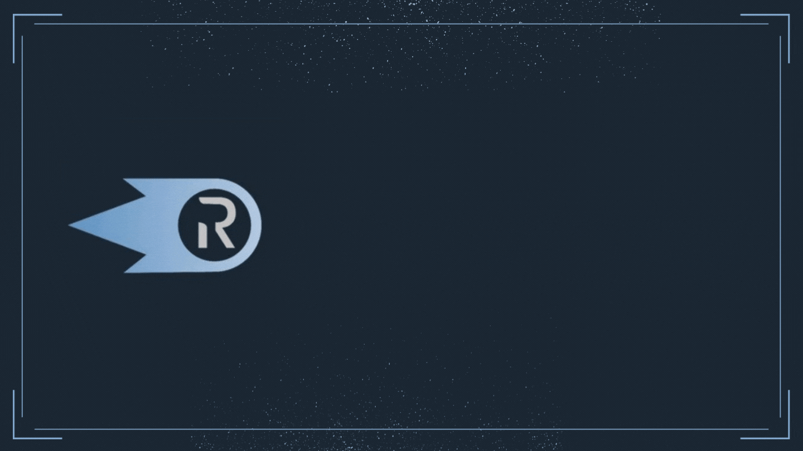

# 🏃♂ Quickstart

<figure><figcaption></figcaption></figure>

## :man\_running: REX Quickstart&#x20;

This is an easy guide to streaming your first DCA flow into ETH from USDC


Ricochet Exchange is a management application for decentralized finance protocols that run on Polygon, including but not limited to Superfluid, Uniswap, Gelato, Chainlink, SushiSwap, and Quickswap. Ricochet Exchange is not affiliated with companies or teams behind these protocols and we can make no guarantees regarding their stability or security.&#x20;

Additionally, there are no guarantees regarding the safety of funds that have been in any way used within Ricochet Exchange contracts. We cannot compensate users for funds that have been lost during use within Ricochet Exchange or that have at any point in time been used within Ricochet Exchange. By using Ricochet Exchange you agree to these terms and acknowledge that you are aware of the existing risk and knowingly accept it.


## Dollar-cost Averaging USDC to ETH


This tutorial assumes you have USDC on Polygon; make sure you have enough funds to avoid disconnection while streaming.&#x20;


### 1. Approve & Deposit your USDC on the Wallet page

Navigate to the Wallet page and click the + button to start the process for streaming your USDC into the USDCx contract.&#x20;

<figure><figcaption></figcaption></figure>

After approving the transaction, deposit funds into USDCx contract and  head to the Market page to start your DCA stream.

<figure><figcaption>
deposit the amount of funds you want to and start your DCA stream
</figcaption></figure>


Depending on your RPC URL it may take 10 block confirmations before the app will detect that you have approved your USDC.


### 2. Start your DCA stream on the Market Page

Confirm you have a USDCx balance (after streaming USDC) and then click on the USDC-ETH market section to expand it. Enter a rate in USDCx/month you want to DCA into ETH and then click the Start/Edit button.    &#x20;

<figure><figcaption></figcaption></figure>

Once this transaction confirms, your DCA flow has been initiated. Check back in 30 minutes to see the ETH you've earned. The swap for this market triggers every 30 minutes so you can have a visual of how your money is moving!&#x20;


You can start a stream for more than your wallet balance. For the above example, the USDCx balance will exhaust after 1  month because you're streaming at a rate of 10 USDCx/month and you have 10 USDCx. If you want to continue with your monthly streams, just approve and deposit some USDC in the wallet page.


### 3. **Withdraw your WETHx to get WETH in your wallet**

After earning and accumulating some WETHx, you could withdraw it and bridge to another DeFi protocol such as AAVE. To do this, go to the wallet page and click on the - button, input amount and withdraw WETH from the WETHx contract. Check your wallet for confirmation that you have WETH in your wallet.

<figure><figcaption></figcaption></figure>


**Hey, you made it this far in the tutorial so big ups! 🥳**

If you've got any questions, unclear sections, or suggestions, make sure to let us know in the [Discord](https://discord.com/invite/egu4FZbPBM). Happy streaming!


***
