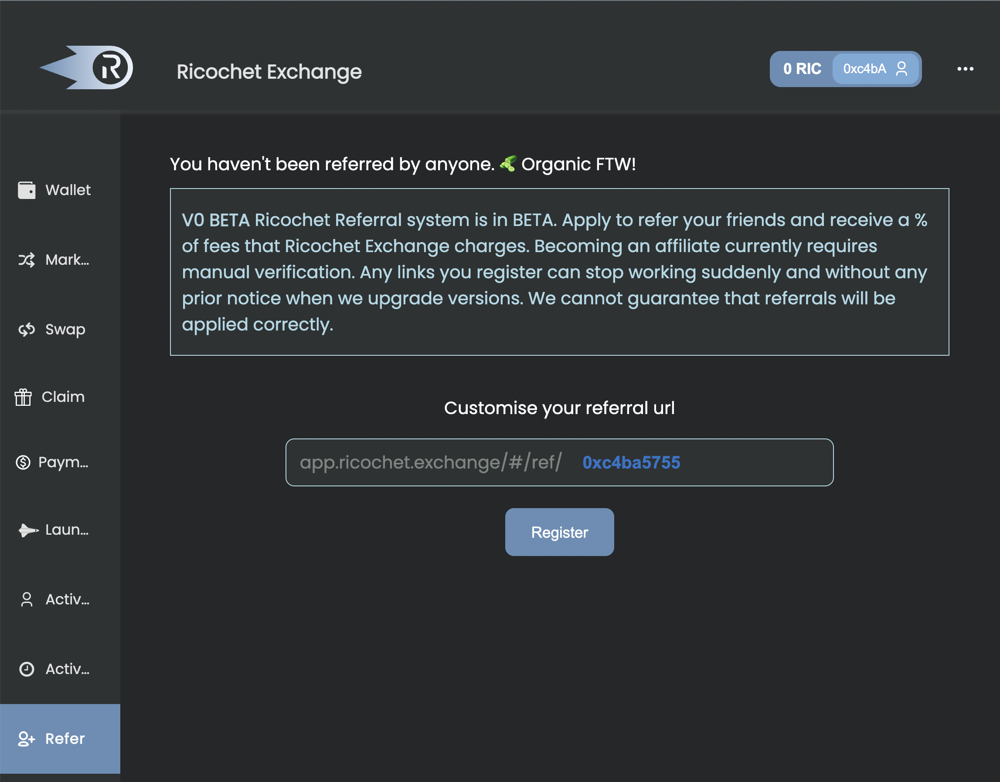

# 🔁 -Referral Program

## Overview

The REX Affiliate Program lets you earn a portion of the fees from the volume you refer. Learn how to get started as a REX Affiliate.

**How to become a REX Affiliate**

If you're new to Ricochet, head over to the [start page](../tutorial/using-the-dapp.md) to learn how to register. Once you have successfully created an account on the platform ([https://ricochet.exchange](https://app.ricochet.exchange/))  with your wallet connected and you've been able to DCA-stream tokens, follow these steps to become an affiliate:

* **Step 1**

&#x20; Go to the REX [launch page](https://ricochet.exchange/) and click on the 'Refer' button at the left option bar on the page. Register your personally customized referral URL provided on the page.

<figure><figcaption>
The refer button helps you create your personal referral link.
</figcaption></figure>

* **Step 2**

<figure><figcaption>
Sign the Metamask request notification to continue the registration.
</figcaption></figure>

&#x20; **** After you click register, you'll receive a signature request from your Metamask wallet for the link registration fee. Sign the request to proceed with your registration.

* **Step 3**

After successfully registering your referral link, you'll enter an approval period. The approval period is essentially completed in the discord; you'll get a pending approval message where you are redirected to the REX discord and you'll be approved as an affiliate.&#x20;

[https://discord.gg/ptqCBnJ9dr](https://discord.gg/ptqCBnJ9dr)

<figure><figcaption>
Click on the linkto get redirected to REX discord to get approved as an affiliate.
</figcaption></figure>

* **Step 4**

&#x20; ****  Once approved, share your link ,start referring and start earning!

### Why should become an Affiliate member?

As an affiliate member, you receive **50%**  of Ricochet fee on token swaps made by your referee( i.e you earn half of REX fees on all streams made by the person you refer!).&#x20;

For example, if you refer someone and they make a stream of $1000 a month, REX charges 2% of the total funds, that's $20. If you're the referrer, you get $10 while Ricochet gets $10!&#x20;

Also, an affiliate member gets 1% of the total supply volume generated from referrals.&#x20;

You can get registered as an affiliate member **TODAY** if you've been an active member of Ricochet Exchange. Just click on this link [app.ricochet.exchange](https://www.app.ricochet.exchange/wallet), follow the steps above and earn away!
