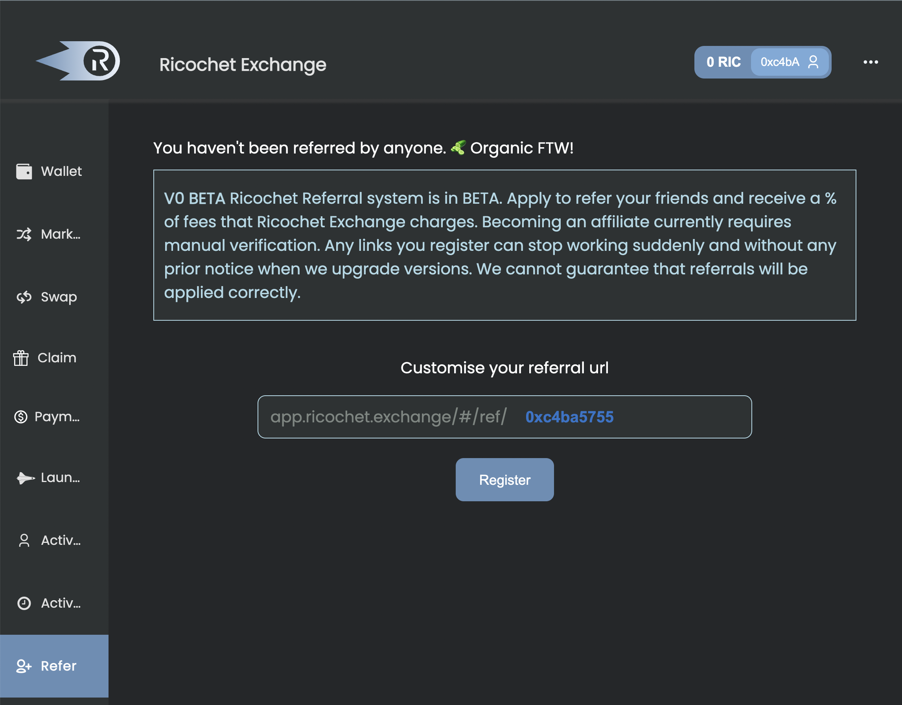

# 🔁 - Referral Program

## Overview

The REX Referral Program lets you earn a portion of the fees from the volume you refer. Learn how to get started as an affiliate below.

## Current Affiliates

Existing affiliates include:

| Ledger                                       | Alluo Finance                                                     |
| -------------------------------------------- | ----------------------------------------------------------------- |
|  |  |

and so many more!

## **How to become a REX Affiliate**

To become a REX Affiliate, follow these steps:


**Make a new account address** if you plan to become an affiliate.&#x20;

Only use that wallet for this referral program.&#x20;


### **Step 1: Choose a Affiliate ID**

Go to the REX Referral page: [https://app.ricochet.exchange/#/refer](https://app.ricochet.exchange/#/refer). Enter your personalized referral URL provided on the page or use your address which is the default URL. Then click Register

<figure><figcaption>
The refer button helps you create your personal referral link.
</figcaption></figure>

### **Step 2: Register your Affiliate ID**

&#x20;**** After you click register, you'll receive a signature request from your Metamask wallet for the link registration fee. Sign the request to proceed with your registration. Someone from the core team will need to approve your registration.

<figure><figcaption>
Sign the Metamask request notification to continue the registration.
</figcaption></figure>

### **Step 3: Ask for Approval in Discord**

After successfully registering your referral link, you will enter an approval period. You should see the message "Awaiting verification. Come back later" message. This is completed on the Ricochet discord. Ask in the #support channel to be approved.&#x20;

[https://discord.gg/ptqCBnJ9dr](https://discord.gg/ptqCBnJ9dr)

<figure><figcaption>
Click on the link to get redirected to REX discord to get approved as an affiliate.
</figcaption></figure>

### **Step 4: Share your link**

Once approved, share your referral link with others and start earning!

## Why should become an Affiliate?

As an affiliate **you receive 50% of the fees charged by Ricochet** to accounts you refer. If you refer an account that DCAs $1000 with the protocol, Ricochet charges a 2% fee for the transaction, you would earn $10 (50% of the $20 fee). These rewards can provide a significant source of income if you are able to successfully refer a large amount of volume to the protocol.

You can get registered as an affiliate **TODAY.** Just click on this link [app.ricochet.exchange](https://app.ricochet.exchange/#/refer), follow the steps above and start earning away! The Referral System is completely on-chain and you'll receive your rewards every few hours.&#x20;

