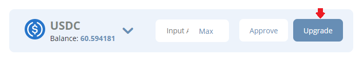

# 🏃♂ - Quickstart

## Streaming USDC to ETH


This tutorial assumes you have USDC on Polygon


### 1. Approve your USDC on the Wallet page

**What's going on?** \
****Basically, you're allowing the USDCx contract to receive your USDC.

### 2. Upgrade your USDC on the Wallet page

**What's going on?**\
****You're wrapping your USDC into USDCx which gives it the ability to be streamed using Superfluid

### 3. Enter how much USDCx you want to stream per month and hit start on the Invest page

.png>)

**What's going on?**\
****USDCx will begin to stream out of your wallet by the second into the USDC>>ETH Stream Market smart contract which will distribute the appropriate amount of WETHx back to you each hour. Basically, hourly dollar-cost-averaging (DCA)


You can start a stream for more than your wallet balance. For the above example, the USDCx balance will exhaust after 1/2 a month because you're streaming at a rate of 700 USDCx/month and you only have 350 USDCx.


### **4. Downgrade your accumulated WETHx balance on the Wallet Page**

So, some time has passed and you've accumulated some WETHx. Now you want to downgrade to plain ol' WETH. Go to the downgrade widget on the Wallet page.

.png>)

Put in the amount of WETHx you want to downgrade, hit downgrade, confirm the transaction, and wait for the WETH to appear in your wallet!

**What's going on?**\
****You unwrapped the WETHx you were distributed by Ricochet into regular WETH.


**Congrats on completing the Quickstart tutorial 🥳**

If you've got any lingering questions, issues, or suggestions, make sure to let us know in the [Discord](https://discord.com/invite/egu4FZbPBM). Cheers!


****
