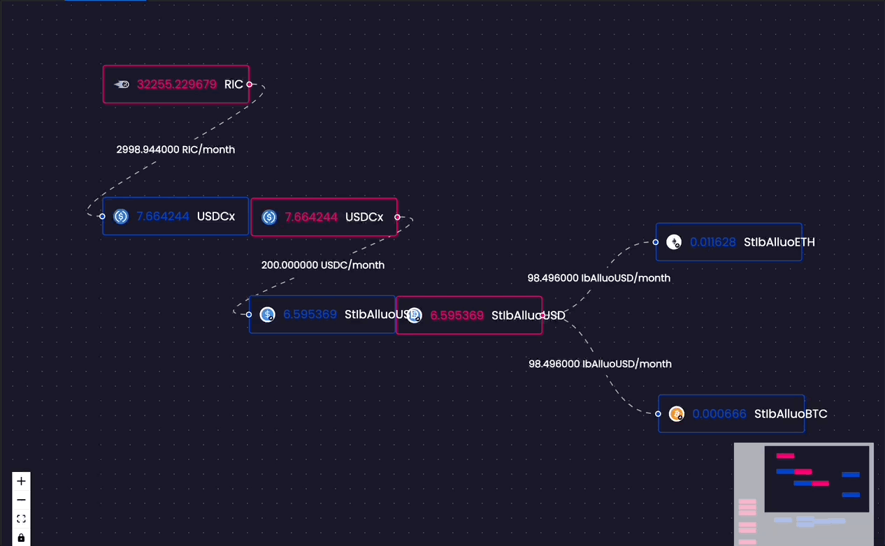

# 📽 - REX Projects

Ricochet Exchange is dedicated to creating pioneering tools that allow individuals to make real-time investments with their crypto assets using Superfluid. Streaming operations are designed to be easily visualized and followed in real-time. Learn more about our projects below.&#x20;

<figure><figcaption></figcaption></figure>

### REX Market - [LIVE](https://app.ricochet.exchange)

This project revolves around building and maintaining a decentralized exchange that enables automatic real-time investing on Polygon. Ricochet Exchange contracts leverage Superfluid for streaming tokens and Tellor Oracle for price data, as well as SushiSwap/QuickSwap for liquidity. Both individuals and organizations can use the exchange to easily invest their capital and income streams into and out of ETH, WBTC, and other cryptocurrencies in real-time. Learn more about our project to discover the full range of benefits and features it offers.

<figure><figcaption>
Investing in Ethereum with DAI in real-time through Ricochet Exchange
</figcaption></figure>

#### Interactive Stream Manager

Construct a _DCA flow_ **** using the REX Market Interactive Stream Manager interface.

### REX Launchpad - [LIVE](https://app.ricochet.exchange)

<figure><figcaption>
RIC, rexSHIRT, rexHAT tokens are currently being sold on the Ricochet Launchpad
</figcaption></figure>

The Launchpad intends on creating a **launchpad contract for projects to use to do fair ICOs**. This launchpad does away with front-running by offering tokens at a fixed distribution rate. Streamers can compete to earn a portion of the distributions. See an example below where the price discovery would put $RIC's price at 0.50 USDC. [Try it out now >>](https://app.ricochet.exchange/#/invest/rex-launchpad)

.png>)

## Experimental Products

#### REX Tokens and REX LP streaming

REX Tokens are used on the Ricochet Exchange to provide real-time yield to streamers. These yield-bearing tokens represent a claim on ERC20 tokens that are staked in reward systems, such as SushiSwap Farms. Streamers can earn REX Tokens by streaming USDC into the exchange. The exchange will then take the underlying tokens and stake them in a reward system, allowing streamers to receive their rewards directly to their wallet in real-time.&#x20;

